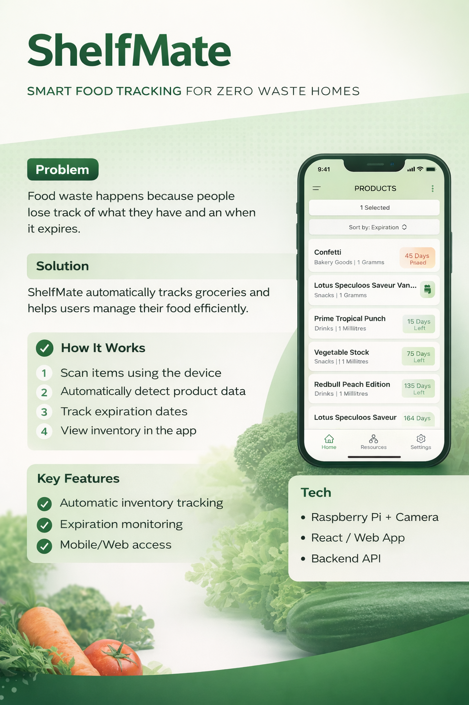

# ShelfMate

ShelfMate is a smart food tracking system designed to reduce household food waste by creating a clear, real-time overview of stored groceries.

It combines a physical scanning device with a web application to automatically track food items and their expiration dates.

---

## Problem

Food waste in households is often caused by a lack of visibility:

- People forget what they have
- Expiration dates are overlooked
- Inventory is not centrally managed

---

## Solution

ShelfMate creates a structured inventory directly from real-world interaction.

- Scan groceries using a dedicated device
- Automatically identify products via APIs
- Store and track items in a central system
- Monitor expiration dates in real time

---

## How It Works

1. Place an item in front of the scanner  
2. Product data is detected and enriched via external APIs  
3. Item is stored in the system  
4. Inventory is updated instantly  
5. Users can access all items via the web app  

---

## System Overview

ShelfMate follows a modular architecture:

- **Scanner Interface** → captures and processes product data  
- **Backend API** → handles business logic and persistence  
- **Scan Server** → manages hardware communication  
- **Web Application** → displays inventory and user interaction  

---

## Tech Stack (High-Level)

- **Hardware**: Raspberry Pi + Camera  
- **Frontend**: React (Web App)  
- **Backend**: Node.js / API Services  
- **Data Sources**: OpenFoodFacts API + internal database  

---

## Preview

---

## Components

This repository consolidates all parts of the system:

- **[Scan Interface](https://github.com/shelf-mate/scan-interface)**  
- **[Backend](https://github.com/shelf-mate/backend)**  
- **[Scan Server](https://github.com/shelf-mate/scan-server)**  
- **[Webapp](https://github.com/shelf-mate/webapp)**  
- **[API Client TS](https://github.com/shelf-mate/api-client-ts)**  

---

## Key Characteristics

- Real-world interaction → digital system  
- Automatic inventory tracking  
- Modular, scalable architecture  
- Focus on simplicity and usability  

---

## Notes

This project explores how physical interfaces and software systems can be combined to solve real-world problems like food waste.

Future improvements may include more advanced product recognition and extended multi-user support.
